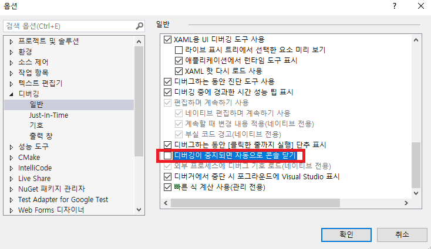

# 삼성전자 SW 역량테스트 대비

## 기본자료 1. 바킹독
- [유튜브](https://youtu.be/LcOIobH7ues?si=H38RqHtxx6ggNgWI)
- [블로그](https://blog.encrypted.gg/921)

> 기본자료는 바킹독을 참고. 1주일 남았으므로, 코드트리나 백준에 있는 기출문제를 풀 예정.

## 삼성전자 SW 역량테스트 합격 전략
- [링크](https://www.codetree.ai/blog/%EC%82%BC%EC%84%B1-sw-%EC%97%AD%EB%9F%89%ED%85%8C%EC%8A%A4%ED%8A%B8-%EC%A4%80%EB%B9%84-%EC%8B%A4%EC%A0%84-%EB%AC%B8%EC%A0%9C-%ED%92%80%EC%9D%B4%EB%B6%80%ED%84%B0-%ED%95%A9%EA%B2%A9-%EC%A0%84%EB%9E%B5/)
- [실제 후기](https://flik.tistory.com/38) / [실제 후기2](https://garden1500.tistory.com/8) / [실제 후기 3](https://vivivic98.tistory.com/42)
- visual studio를 이용할 경우 - 파일 입출력
  - (1) [리소스파일에 새파일 추가](https://zoosso.tistory.com/930) (freopen(), #define _crt_secure_no_warnings)
  - (2) [디버깅창](https://zoosso.tistory.com/926) (입력: <, 출력: >)
  - (3) 리소스파일에 기존 파일 추가하는 방법 찾자 (추적이 안되는데 왠지 모르겠다..?)

### 문제 풀이 전략
1. 시간 분배 (4시간 2문제)
    - 이상적인 시간: 문제 읽는 시간 20분 / 로직 필기하는 시간 20분 / 실제 구현 시간 40분 / 디버깅, 테스트 시간 20분
      (20m + 20m + 40m + 20m = 1h 40m)
    - 두 문제 모두 읽고, 자신 있는 문제 먼저 풀자 -> 1솔 목표
2. DFS 보다는 BFS
    - BFS로 풀이 먼저 생각하고, 도저히 안 되면 DFS로 빠지기 (BFS가 더 유리함)
3. 전역변수 초기화
    - 전역 변수 초기화 필수 (memset 등)
    - 문제 풀이할 때, 마지막 테스트 케이스를 가장 먼저 앞에 배치. 마지막 케이스가 일반적으로 배열의 크기가 크므로 초기화가 잘 되는지 확인하기 위함.
4. 루틴
   - 도구 -> 옵션 -> 일반 (어둡게)
   - 도구 -> 옵션 -> 키보드 (vscode)

#### 2024년 하반기 후기
1. 시간 축약 - 실제 테스트 때 1.5배 정도 더 오래 걸리는 기분
2. 인텔리센스 다 꺼져 있어서, 오타 알아보기 힘들다 *예) (memcpy(fox, fox, sizeof(backup))*
3. ctrl + d 안 먹힘 -> 당황, 어느새 마우스로 고치고 있었음 - 코드 짜는 시간 매우 느려짐
4. 빌드 실패: 프로세스를 킬하거나, 파일 명을 바꾸면 됌.
5. f5 디버깅 안 됨 - 예외 처리 발생함.
  > 예상 원인 디버깅 시, 스택 오버플로우 발생. 전역변수 말고, 지역변수에 큰 메모리를 할당해서. ctrl+f5 는 됐지만, f5는 안된 듯.
  >  1) 첫번째 해결 방법: 큰 메모리 할당은 지역변수에서
  >  2) visual studio 내 설정 변경 (링킹 - 시스템 - 스택 예약키그 4백만(약 4MB)으로 변경) https://penguin-kim.tistory.com/15
7. 빌드 테스트 방법이 상반기와 달라짐.
8. 생각보다 이슈가 많았음. 상반기에 운이 좋았던 걸로.. (내가 친 고사장은 와이파이부터 충전 이슈 모두 있었고, 내 경우에는 이전 사람이 파일을 안 지우고 감)
9. 문제 구현 난이도는 기출과 유사 + 아이디어 추가 정도로, 못 풀 문제는 아니었으나, 시간 부족 or 빌드 안 되면서 멘붕
10. 결론) 상시테스트로 환경에 익숙해지는 것이 중요할 듯 (2번 정도..?)

## 시뮬레이션
1. 풀이 핵심 키: 회전
   - rot { 0, 90, 180, 270 } = ```{ (x, y), (y, N - 1 - x), (M - 1 - y, N - 1 - x), (M - 1 - y, x) }```
      - ```N = 5, M = 5, (1, 3)```으로 검산하자
   - 기준 1: 정사각형: 직사각형인 경우, 90도랑 270도일 때, ```swap(N, M)```은 필수
   - 기준 2: (0, 0) 부터 시작
     - (0, 0)이 아닌 다른 위치에서 시작한다면, (offsetX, offsetY)에서 (0, 0)로 밀기
     - 원상 복구: ```[nx + offsetX][ny + offsetY]```
   - 코드 짤 때 순서 조심
       ```tmp[y][N - 1 - x] = arr[x][y]``` -> ```arr[x][y] = tmp[x][y]``` (반대로 하면 문제 생김)
2. URLD or DRUL

## 다익스트라 알고리즘

## 거듭제곱 연산: pow() 안 됨

## 콘솔창 바로 닫히는 현상?
디버그 옵션에서 `디버깅이 중지되면 자동으로 콘솔 닫기` 체크
